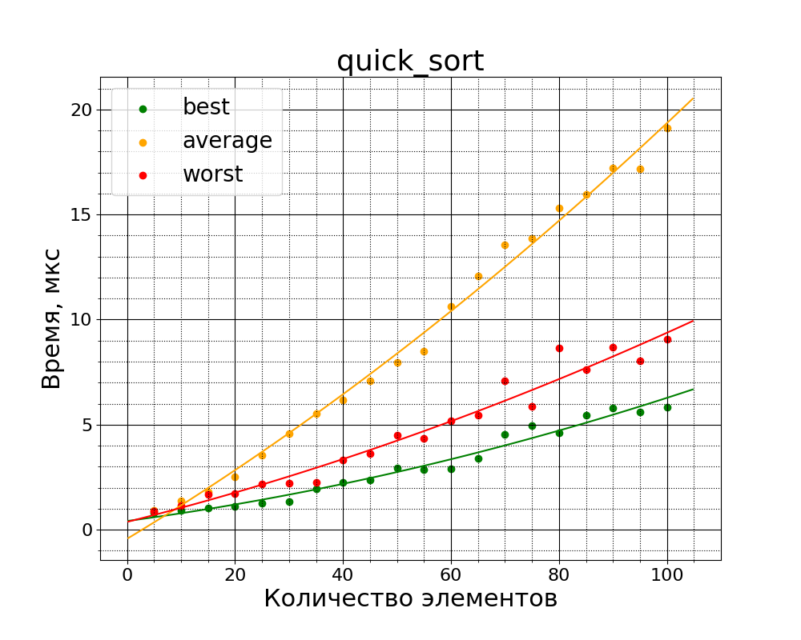
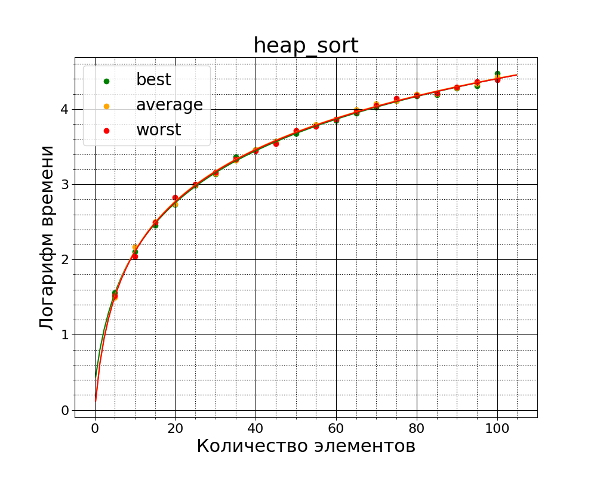

# Тесты сортировок #

Были протестированы 4 вида сортировок:
- Сортировка пузырьком
- Пирамидальная сортировка
- Сортировка слиянием
- Быстрая сортировка

Среднее время их выполнения приведены на графике ниже

Также былт измерены эти сортировки на разных наборах данных:
- Плохих (Отсортированных в обратном порядке)
- Хороших (Отсортированных в нужном порядке)
- Средних (Просто случайные данные)

Для каждого типа данных выполнены по 10000 прогонов

Далее графики для всех сортировок

И те же графики, только ось времени в логарифмическом маштабе

Судя по моим тестам самой быстрой сортировкой оказалась quick sort (да, масло масляное)